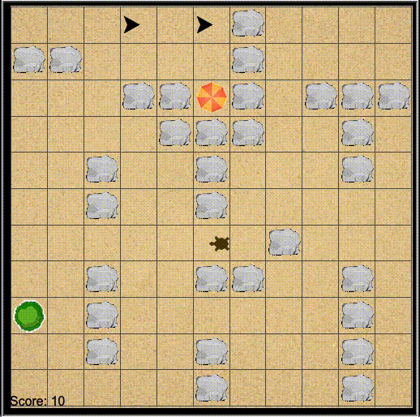

# Welcome to She Codes

We're big fans of of turtles and programming here at She Codes, so we thought, why not combine the two?!

You're task is to create a game using the Python Turtle. Here's a snippet of the game to give you an idea of what you are working towards:

Here's the catch, it's going to take a whole team to complete the game, so you'll need to find two other coders to work with.

[Let\'s get started!](../../introduction/)
